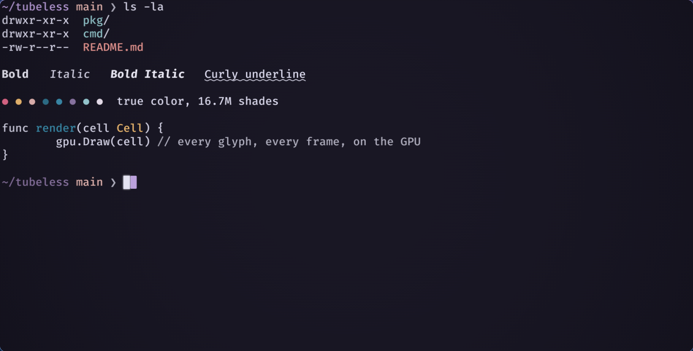
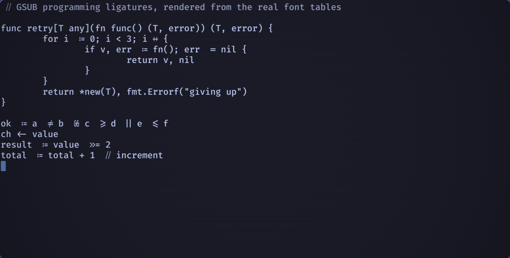
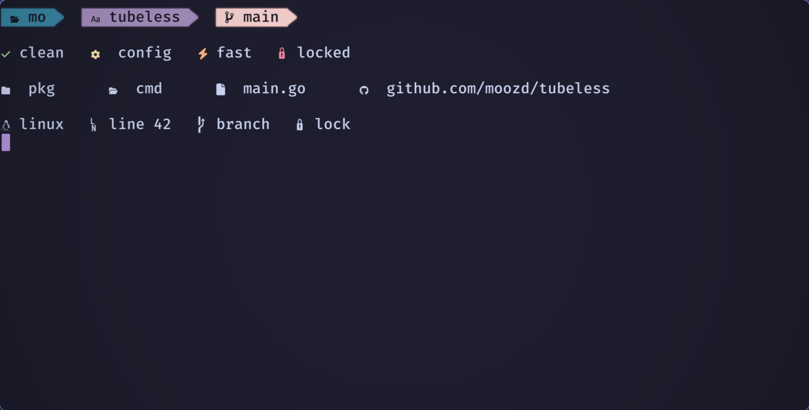
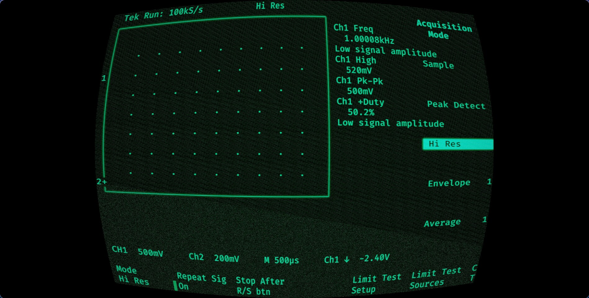

# tubeless

A GPU-rendered terminal emulator, written in Go on top of GLFW/OpenGL —
built to be a terminal you enjoy looking at, not a strict emulation
exercise.



Every glyph — including bold, italic, ligatures, and the cursor glow —
is drawn on the GPU, not blitted from a bitmap font cache. That's what
lets a few things most terminals don't bother with:

### Real programming ligatures, from the font's own GSUB tables

`=>`, `!=`, `<-`, `>=` and friends are shaped by HarfBuzz straight from
whatever font is loaded — including fonts (FiraCode, Cascadia Code,
JetBrains Mono) that implement a ligature by reshaping two glyphs to
visually connect rather than merging them into one, a case worth
getting right on its own.



### A GPU icon atlas wide enough for the full Nerd Font set

Powerline separators, devicons, and Nerd Font glyphs render at full
fidelity — including automatic upscaling for undersized icons — so
prompts, statuslines, and file-tree glyphs look right instead of
clipped or blurry.



### Period-accurate CRT emulation, not a generic scanline filter

Six monitor presets (IBM 5151/5153, Zenith ZVM-1220, Apple Monitor III,
Commodore 1084S, Princeton HX-12), plus a modern flat default, each
modeling one real display's curvature, phosphor persistence, and
convergence error from its actual service manual — tuned against
reference photos of the real hardware.



### A GPU-rendered settings UI, live inside your own terminal

`tubeless config` runs as a normal VT program — it edits and previews
every setting (theme, font, cursor, CRT effects) rendered through the
same pipeline your shell uses, with a live preview strip, no separate
GUI window or restart required.


## Features

- GPU-rendered text with real italic/bold glyphs, curly underlines, and
  a rounded-rect glow cursor that glides smoothly between cells
- Native Wayland and X11 backends on Linux; native Cocoa on macOS
- True-color rendering with 13 built-in themes (rosepine, rosepine-moon,
  gruvbox-dark-hard, nord, dracula, catppuccin-mocha, tokyo-night,
  one-dark, green, amber, green-p39, white-p4, cga) plus a custom theme
  editor, and a set of period-accurate 80s monitor effect presets (IBM
  5151/5153, Zenith ZVM-1220, Apple Monitor III, Commodore 1084S,
  Princeton HX-12) — all in a tabbed, in-terminal config UI
  (`tubeless config`)
- Scrollback, fast scroll/insert-line/delete-line, sixel image output
- Mouse selection and clipboard copy/paste (Cmd+C/V on macOS,
  Ctrl+Shift+C/V on Linux), aware of apps that request their own mouse
  reporting (tmux, vim, htop) so it doesn't fight them for the mouse
- Config-file driven: `~/.config/tubeless/config.toml` (same path on
  every platform, including macOS; respects `$XDG_CONFIG_HOME`) — see
  [docs/config.md](docs/config.md) for the full reference

## Install

```sh
./install.sh
```

Detects your OS and installs the right package: `.deb` on Debian/Ubuntu,
`.rpm` on Fedora/RHEL/openSUSE, an Arch package on Arch/Manjaro, a
generic tarball into `~/.local` on any other Linux, or the `.app` bundle
(symlinked onto `PATH`) on macOS. Downloads the latest GitHub release by
default; pass `--version vX.Y.Z` for a specific one, or `--local` to
install from a build you made yourself (see below).

## Build from source

Requires Go 1.21+ and a C toolchain (cgo bindings to GLFW, FreeType, and
HarfBuzz). On macOS, GLFW's Cocoa backend needs to build on an actual
Mac — it can't be cross-compiled from Linux.

Install the build dependencies for your OS:

**Debian/Ubuntu**

```sh
sudo apt-get install -y \
  libgl1-mesa-dev xorg-dev \
  libwayland-dev libxkbcommon-dev wayland-protocols extra-cmake-modules \
  libharfbuzz-dev libfreetype-dev pkg-config
```

**Fedora/RHEL**

```sh
sudo dnf install -y \
  mesa-libGL-devel libXcursor-devel libXi-devel libXinerama-devel libXrandr-devel \
  wayland-devel libxkbcommon-devel wayland-protocols-devel extra-cmake-modules \
  harfbuzz-devel freetype-devel pkgconf-pkg-config
```

**openSUSE**

```sh
sudo zypper install -y \
  Mesa-libGL-devel libX11-devel libXcursor-devel libXi-devel libXinerama-devel libXrandr-devel \
  wayland-devel libxkbcommon-devel wayland-protocols-devel extra-cmake-modules \
  harfbuzz-devel freetype2-devel pkg-config
```

**Arch/Manjaro**

```sh
sudo pacman -S --needed \
  mesa libx11 libxcursor libxi libxinerama libxrandr \
  wayland libxkbcommon wayland-protocols extra-cmake-modules \
  harfbuzz freetype2 pkgconf
```

**macOS**

```sh
brew install freetype harfbuzz pkg-config
```

(GLFW's Cocoa/OpenGL backend comes from the system frameworks via Xcode
Command Line Tools — no separate package needed.)

Then build:

```sh
make build            # tubeless, tubeless-config, tektest -> bin/
make install           # detects the OS and installs (Linux: ~/.local,
                        # override with PREFIX=; macOS: Tubeless.app +
                        # symlink onto PATH)
```

Run `make help` for every target, including `package-linux`/
`package-darwin` (build distributable packages into `dist/`) and the
`run-*` dev shortcuts.

## Usage

```sh
tubeless                  # start a terminal with your $SHELL
tubeless --theme=nord     # start with a specific theme
tubeless --font="JetBrains Mono" --font-size=16
tubeless --shell=/path/to/program
tubeless config           # open the in-terminal settings UI
tubeless upgrade          # check GitHub for a newer release, install it, and restart
tubeless --version        # print the build version
```

See [docs/config.md](docs/config.md) for the full config file
reference — every theme, preset, and TOML key.

## License

MIT — see [LICENSE](LICENSE).
